.. _cri_walkthru:

.. image:: _static/CRIkit2_Logo.png
    :align: left

|
|
|
|
|
|
|

Walk-Thru: CRI Processing
=========================

This walk-thru will take you through several steps:

- `Overview`_
- `Generating the built-in Raman/BCARS numerical phantom`_
- `Viewing dark, NRB, and dataset spectra`_
- `Dark subtraction`_
- `Residual dark subtraction (Optional)`_
- `Variance stabilization`_
- `Denoising via singular value decomposition (SVD)`_
- `The inverse Anscombe transformation`_
- `Phase retrieval via Kramers-Kronig relation`_
- `Phase error correction`_
- `Scale error correction`_
- `Calibration`_
- `Saving`_
- `Pseudo-color imagery`_
- `Skipped actions in a normal CRI workflow`_
    - `Loading HDF file Hsi dataset`_
    - `Loading Dark dataset`_
        -`Denoise Dark (Optional)`_
    - Loading an NRB dataset
        - `Loading an NRB from HDF file`_
        - `Load an NRB from a region-of-interest (ROI)`_

The screenshots within this manual may or may not reflect the exact look of the
version of CRIkit2 UI that you are using.

Overview
--------

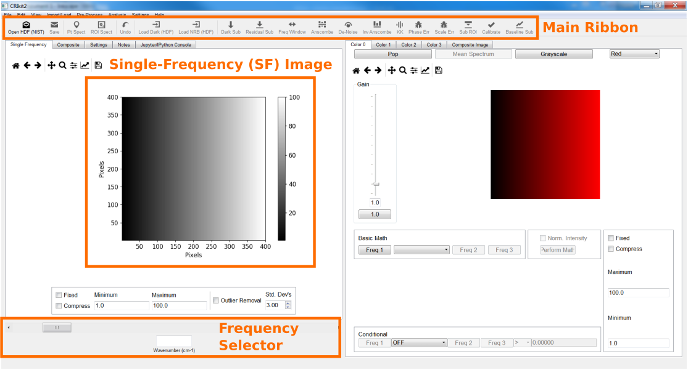

Generating the built-in Raman/BCARS numerical phantom
-----------------------------------------------------
CRIkit2 comes with a built-in numerical phantom, which is dervived from an
actual BCARS image collected from murine pancreas tissue [Camp16]_. This 
numerical phantom may be used as a **Raman** or a **BCARS** model. The Raman
model produces an HSI wherein each pixel contains a Raman spectrum. The BCARS
model incorporates a nonresonant background (NRB) and excitation source profile;
thus, generating raw BCARS spectra, similar to those generated here at NIST [Camp14]_.

1. **Help** >> **BCARS Numerical Phantom**
2. Check Noise and Dark check boxes.
    - **Check** Gaussian (AWGN)
        - **Std Dev**: 12.44
    - **Check** Poisson
        - **Multiplier (alpha)**: 1.4
    - **Check** Dark Constant
        - **Level**: 1600.0
3. Select Subsampling
    - Subsampling will reduce the memory and performance burden on your computer.
    - This tutorial will demonstrate with 1x (no sub-sampling), but you can feel
      free to use up to 4x to make things speedier.
4. Press **Ok** pushbutton.    

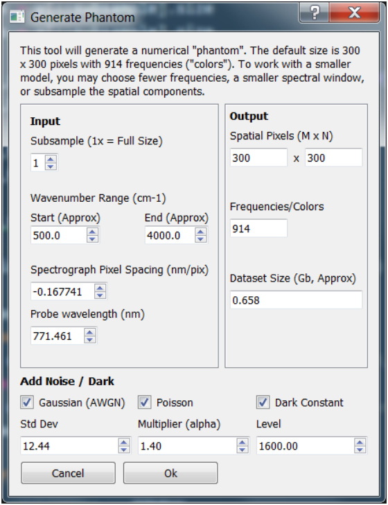

There now is a fully loaded BCARS phantom. Additionally, the **NRB** reference
is loaded (**View** >> **NRB Spect**) and the **Dark** spectrum is loaded
(**View** >> **Dark Spect**).

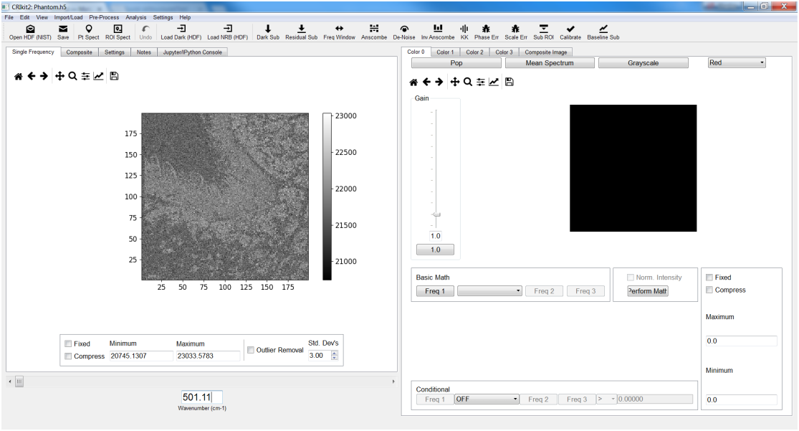

Viewing dark, NRB, and dataset spectra
--------------------------------------
To view the loaded **Dark** spectrum(a):

- **View** >> **Dark Spect**

To view the loaded **NRB** spectrum(a):

- **View** >> **NRB Spect**

There are two primary methods to view spectra from within the dataset: point 
spectra and ROI spectra.

To view the spectrum from a single point within the dataset (2 methods):

- **View** >> **Pt Spect**
- Click the **Pt Spect** button on the main ribbon

Either method will change your cursor into a cross. Select a pixel within the
**single-frequency (SF) image** and **left-click**. This will pop-up the plotter window with the
spectrum.

To view the mean spectrum from within an ROI (2 methods):

- **View** >> **ROI Spect**
- Click the **ROI Spect** button on the main ribbon

Again, either method will change your cursor into a cross. The ROI is defined by
a polyhedron within the **single-frequency (SF) image**. Select vertices with 
a **left-click** with your mouse. Close the polyhedrom with a single
**right-click**. The location of the right-click does not matter as this only 
indicates to connect the last selected vertex and the first. This will pop-up 
the plotter window with 2 components: the mean spectrum (dark, solid line) and 
a patch (lighter, solid shading) that indicates plus-minus 1 standard deviation.

.. image:: _static/cri_wt/RoiRawSpectra.png
    :align: center

Dark subtraction
----------------
The dark signal is the intrinsic signal level generated by the detector, even
when no photons are incident on the detector. Typically, a measurement is made
with the detector (or incident) sources blocked.

Under normal operation, you would load a dark spectrum(a) from an external
file. During the generation of the BCARS numerical phantom, the dark signal
is co-generated.

To subtract the dark spectrum(a) from the HSI (2 methods):

- **Pre-Process** >> **Dark Sub...**
- Click the **Dark Sub** button on the main ribbon

Two pop-up dialog boxes will appear:

- Subtract Dark Spectrum from Image?: **Click**: OK
- Subtract Dark Spectrum from NRB Spectrum(a)?: **Click**: OK

.. image:: _static/cri_wt/Sub_dark_dialogs.png
    :align: center

Variance stabilization
----------------------
CRIkit2 provides variance stabilitization through the forward Anscombe 
transformation that enables signals with mixed additive white Gaussian noise
(AWGN) and shot-noise (Poisson) to be transformed into a signal with 
approximately uniform AWGN only [Foi13]_. Conversely, CRIkit2 provides an
exact, unbiased inverse of the generalized Anscombe variance-stabilizing 
transform [Foi13]_.

Many denoising and factorization methods, such as principle component analysis 
(PCA), singular value decomposition (SVD), nonnegative matrix factorization 
(NMF); explicitly or implicitly assume a normal (i.e., Gaussian) distribution
of noise (and signals). Thus, variance stabilization may aid actions involving
such tasks [Camp16]_.

In this tutorial, we will use the Anscombe transformation prior to
**SVD denoising**. Additionally, we will apply the **inverse Anscombe** 
transform **after** SVD denoising.

To perform the forward Anscombe transformation (2 methods):

- **Pre-Process** >> **Standardize** >> **Anscombe**
- Click the **Anscombe** button on the main ribbon

A pop-up dialog will appear asking for two necessary pieces of information:

- The standard deviation of the AWGN
- The shot-noise (Poisson) noise multiplier

Normally, one would need to calculate/measure or estimate these parameters, but 
the **numerical phantom, by default, applies**:

- Gaussian noise standard deviation: 12.44
- Poisson noise gain: 1.4

.. image:: _static/cri_wt/Anscombe.png
    :align: center

Denoising via singular value decomposition (SVD)
------------------------------------------------
SVD is a linear algebra method that transforms a matrix into the multiplication
of three matrices: the left-singular vectors matrix, the singular value matrix, 
and the right-singular vector matrix. The use of SVD for denoising has been
extensively explored for both traditional computer imagery 
[Narendra75]_ [Patterson75]_, and CRI [Camp16]_ [Lee11]_.

In short, SVD will decompose the CRI image into a series of images and spectra.
Ideally, the spectra/images that contain real (ie non-noise) signal 
contributions are totally separate from those containing noise. One can thus
reconstruct a noiseless image from the noise-free images/spectra decompositions.

CRIkit2 performs the SVD decomposition and raises a new user interface (UI)
that displays the decomposed images and spectra, providing information to the
user to interactively select those with minimal noise. 

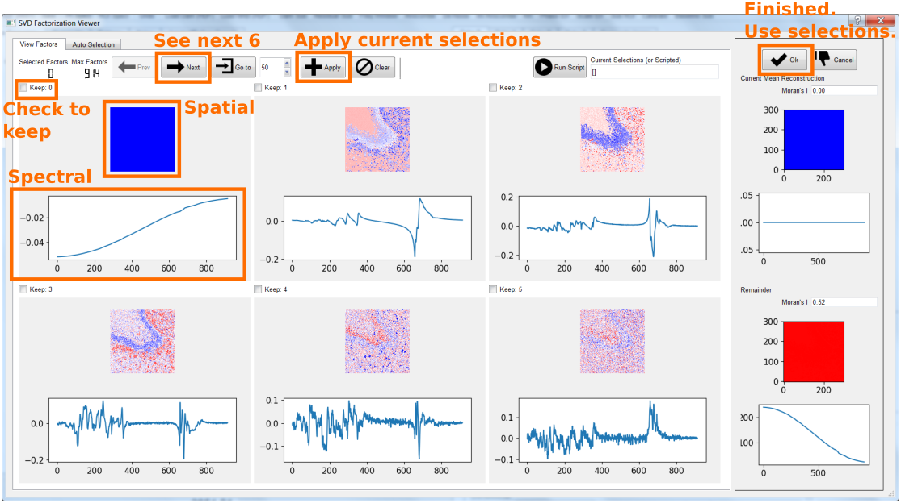

Recommendations:

- Select all singular values with visible spatial **or** spectral components
- Remember to press **Apply** button after selections to-keep of current 6
  displayed.
- Press **Next** pushbutton to view next 6 components.
- Press **Ok** pushbutton to recompose the CRI image with only selected 
  components.

In this tutorial, selections [0,1,2,3,4,5,6] are kept (7 total).

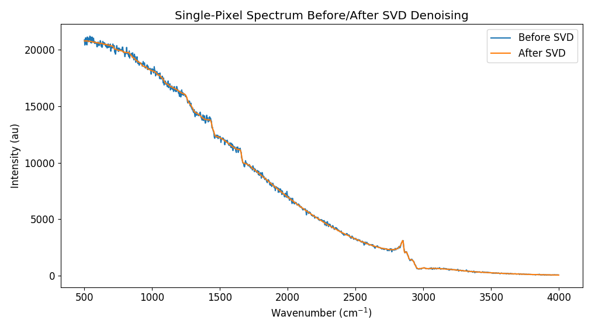

**Note**: The example spectra are before Anscombe-SVD; and after 
Anscombe-SVD-inverse Anscombe.

The inverse Anscombe transformation
-----------------------------------
CRIkit2 provides an exact, unbiased inverse of the generalized Anscombe 
variance-stabilizing transform to convert the variance-stabilized image
back into a mixed-noise version [Foi13]_. 

To perform the inverse Anscombe transformation (2 methods):

- **Pre-Process** >> **Standardize** >> **Inv Anscombe**
- Click the **Inv Anscombe** button on the main ribbon

A pop-up dialog will appear asking for two necessary pieces of information:

- The standard deviation of the AWGN
- The shot-noise (Poisson) noise multiplier

**Note**: these values will be pre-filled with the values entered from the
forward Anscombe transformation. It would be unusual to not use these values.

Phase retrieval via Kramers-Kronig relation
-------------------------------------------
In CRI imagery acquired through CARS methods, phase retrieval methods are
used to separate CARS and NRB signal contribution, i.e. to extract the Raman
spectral signatures [Liu09]_ [Camp16]_.

CRIkit2 provides access to a Kramers-Kronig (KK) relation implemented using a
Fourier transform-based Hilbert transform [Camp16]_.

This KK implementation requires an approximate NRB, which may be imported
through several means:

- Selection of a ROI (e.g., selecting an ROI of water)
- Spectra imported from an external file
- Merging two NRB spectra from ROI's or external files.

During the generation of the BCARS numerical phantom, the NRB signal
is co-generated and loaded.

To perform the KK (2 methods):

- **Pre-Process** >> **Coherent Raman Imaging** >> **KK**
- Click the **KK** button on the main ribbon

.. image:: _static/cri_wt/KKOptions.png
    :align: center

This dialog enables fine-tuning of several parameters:

- NRB bias (constant to add/subract from NRB spectrum)
- CARS bias (constant to add/subract from all HSI spectra)
- Phase offset (constant phase to add/subtract to all KK'd spectra)
- Pad factor (window-padding multiple of spectral length [Liu09]_)

The **Interative Setting Selection** provides preview spectra of several spectra.
These spectra are the mean of the 4 quandrants (i.e. fourths) of the total image
and the center fourth.

.. image:: _static/cri_wt/KKInteractive.png
    :align: center

For this tutorial:

- CARS/NRB bias: 0
- Phase Offset: 0
- Pad Factor: 1

When **finished** press **Ok** pushbutton.

Phase error correction
----------------------
The KK relation will extract Raman signatures accurately under certain conditions,
one being that the NRB can be separately measured and provided -- **at every 
pixel**. This condition, however, can not readily be met; thus, reference NRB
are typically utilized. An ideal reference NRB should not contain any Raman peaks
within the spectral region of interest. Typical examples are glasses, salts, and
water [Camp14]_ [Camp16]_ [Karuna16]_.

Unfortunately, the use of a reference (i.e., non-exact) NRB results in amplitude
and phase error. Phase error correction **and** scale error correction correct
for these complex errors. Phase error correction is performed by finding the 
slowly varying baseline of the spectral phase at each pixel.

CRIkit2 uses an asymmetric least-squares (ALS) method [Eilers05]_. The
custom implementation 3 main parameters:

- P (asymmetry parameter)
- Lambda (smoothness parameter)
- Sub-sampling factor (sub-sample the spectra to improve speed)

**Note**: This is typically the **slowest processing step** in the workflow. A
300 x 300 x 900 pixel image with no sub-sampling of the ALS may require 45
**minutes** or longer to complete.

Additionally, this dialog allows for a **fixed P-value** across the spectrum
or a **log-linear P-value** that varies across the spectrum. For this tutorial
we will use the **Fixed-P**.

To perform phase error correction (2 methods):

- **Pre-Process** >> **Coherent Raman Imaging** >> **Phase Err...**
- Click the **Phase Err** button on the main ribbon

Recommendations:

- The sub-sampling parameter will increase the speed of the detrending
  (potentially quadratically), but at the expense of accuracy.
- Though P- and Lambda-values are independent, the most important factor
  is the ratio of the two.
- There may be window-edge errors at the extreme points of spectra. The 
  **Fix End-Points** option may correct these distortions; though, for extremely
  minor baseline correction, this may cause more harm than help.
- The exact settings are a function of the particular optical system's 
  resolution, spectral sampling, and reference material used.

This tutorial and the numerical phantom, **unlike real experiments**, provides 
the exact NRB; thus, phase-error is extremely small (numerical error).

For this tutorial:

- **Fixed-P**: 1e-6
- **Lambda**: 1
- **Sub-Sampling Factor**: 10
- **Max Iterations**: 100
- **Min Difference**: 1e-6
- **Fix End-Points**: False (Unchecked)

For typical experiments:

- **Fixed-P**: 1e-4 to 1e-2 (increment by half order-of-magnitude)
- **Lambda**: 1
- **Sub-Sampling Factor**: 10
- **Max Iterations**: 100
- **Min Difference**: 1e-6
- **Fix End-Points**: True (Checked)

When **finished** press **Ok** pushbutton.

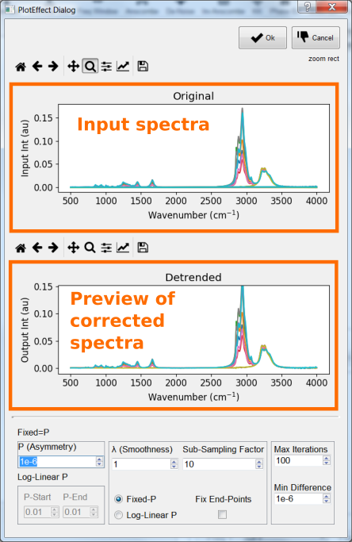

Scale error correction
-----------------------
The use of a reference (i.e., non-exact) NRB results in amplitude
and phase error. Phase error correction **and** scale error correction correct
for these complex errors. Scale error correction is performed by finding the 
median trend line that bisects the real portion of the complex spectra at each 
pixel [Camp16]_.

CRIkit2 uses a Savitky-Golay filter to find a smooth median line, which requires
2 parameters:

- Window width (sliding-window width to polynomial fit). Must be odd-valued.
- Order (order of polynomial to fit)

To perform phase error correction (2 methods):

- **Pre-Process** >> **Coherent Raman Imaging** >> **Scale Err...**
- Click the **Scale Err** button on the main ribbon

Recommendations:

- Set the **order** to 1 or 2
- Expand the **window width** to a large enough value that the median line
  approximately bisects the shown spectra.
- The exact settings are a function of the particular optical system's 
  resolution, spectral sampling, and reference material used.

Typical experimental values:

- **Window width**: 601
- **Order**: 2

When **finished** press **Ok** pushbutton.

.. image:: _static/cri_wt/SG.png
    :align: center

Calibration
-----------
CRIkit2 provides a UI for single-peak calibration that properly accounts
for the nonlinear relationship between wavenumber and wavelength (i.e. what
spectrometers measure across) in BCARS.

In typical bio-experiments, we utilize the 1,004 cm-1 peak (phenylalanine) [DeGelder07]_.

To use a different peak, change the **Correct WN** value to the new peak wavenumber
and fill-in the **Measured WN** with what the average spectra show within the
upper plot.

To perform calibration (2 methods):

- **Edit** >> **Calibrate**
- Click the **Calibrate** button on the main ribbon

Recommendations

- Click the **Zoom** button on the upper plot and select around the 1,004 cm-1
  region.
- Enter the actual peak location in the **Measured WN** box.
- If the spectra do not reveal a feature of interest, return (click **Cancel**)
  to the main UI and use the **ROI Spect** or **Pt Spect** to plot the spectrum
  from a pixel(s) of interest. Identify the location of the particular 
  calibration peak. Re-open the **calibration** tool (ignore the plots) and enter
  the **Correct WN** and **Measured WN** values.

For this tutorial there is no calibration necessary. Click **Cancel** pushbutton.

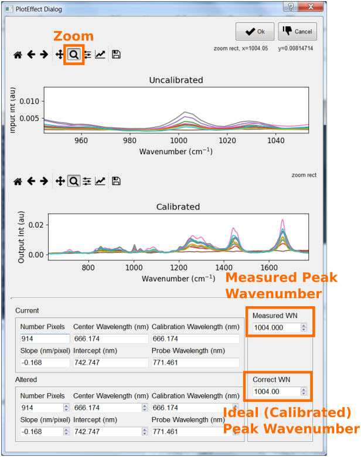

Saving
-------

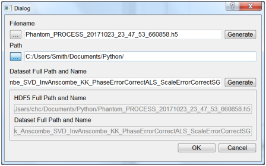

Pseudo-color imagery
--------------------
Nuclei:

- **Color 0** tab
- **Color** drop-down box setting: Yellow
- Math function: "Peak b/w Troughs"
- Peak (Freq 1 button): 786 cm-1
- Trough 1 (Freq 2 button): 767 cm-1
- Trough 2 (Freq 3 button): 809 cm-1
- **Conditional** math function: "SUM"
- Start freq (Freq 1 button): 2700 cm-1
- Stop freq (Freq 1 button): 3000 cm-1
- **Conditional** comparitor: ">"
- **Conditional** value: 1.0
- **Minimum** value setting: 0.002

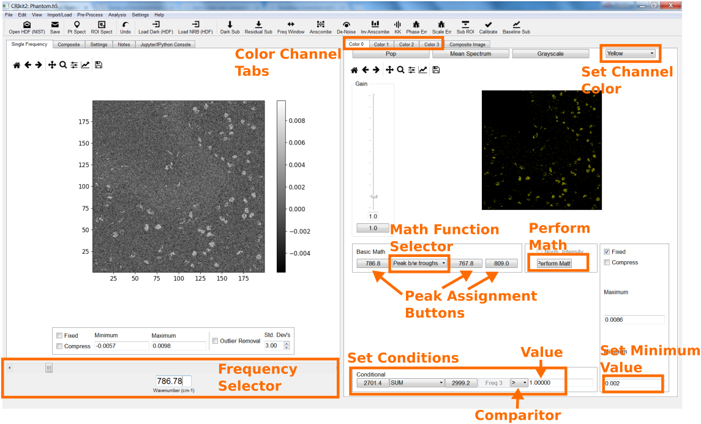

.. image:: _static/cri_wt/Nuclei.png
    :align: center

Phenylalanine:

- **Color 1** tab
- **Color** drop-down box setting: Magenta
- Math function: "Peak b/w Troughs"
- Peak (Freq 1 button): 1002 cm-1
- Trough 1 (Freq 2 button): 986 cm-1
- Trough 2 (Freq 3 button): 1019 cm-1
- **Conditional** math function: "SUM"
- Start freq (Freq 1 button): 2700 cm-1
- Stop freq (Freq 1 button): 3000 cm-1
- **Conditional** comparitor: ">"
- **Conditional** value: 1.0
- **Minimum** value setting: 0.002

.. image:: _static/cri_wt/Phenylalanine.png
    :align: center

Structural Proteins:

- **Color 2** tab
- **Color** drop-down box setting: Cyan
- Math function: "Peak b/w Troughs"
- Peak (Freq 1 button): 937 cm-1
- Trough 1 (Freq 2 button): 902 cm-1
- Trough 2 (Freq 3 button): 980 cm-1
- **Conditional** math function: "SUM"
- Start freq (Freq 1 button): 2700 cm-1
- Stop freq (Freq 1 button): 3000 cm-1
- **Conditional** comparitor: ">"
- **Conditional** value: 1.0
- **Minimum** value setting: 0.002

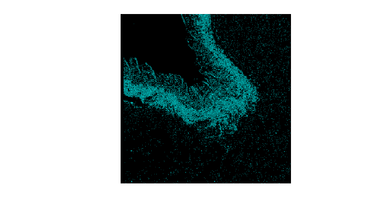

Elastin:

- **Color 3** tab
- **Color** drop-down box setting: B&W (Black-and-white)
- Math function: "Peak b/w Troughs"
- Peak (Freq 1 button): 525 cm-1
- Trough 1 (Freq 2 button): 513 cm-1
- Trough 2 (Freq 3 button): 540 cm-1
- **Conditional** math function: " / "
- Start freq (Freq 1 button): 1003 cm-1
- Stop freq (Freq 1 button): 1029 cm-1
- **Conditional** comparitor: ">"
- **Conditional** value: 1.4
- **Minimum** value setting: 0.0006

.. image:: _static/cri_wt/Elastin.png
    :align: center

.. image:: _static/cri_wt/CompositeColorExample.png
    :align: center

Skipped actions in a normal CRI workflow
----------------------------------------

Loading HDF file Hsi dataset
~~~~~~~~~~~~~~~~~~~~~~~~~~~~
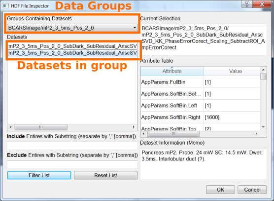

Loading Dark dataset
~~~~~~~~~~~~~~~~~~~~

.. image:: _static/cri_wt/OpenDark.png
    :align: center

Denoise Dark (Optional)
~~~~~~~~~~~~~~~~~~~~~~~

.. image:: _static/cri_wt/denoise_dark.jpg
    :align: center

Loading an NRB from HDF file
~~~~~~~~~~~~~~~~~~~~~~~~~~~~

.. image:: _static/cri_wt/OpenNRB.png
    :align: center

Load an NRB from a region-of-interest (ROI)
~~~~~~~~~~~~~~~~~~~~~~~~~~~~~~~~~~~~~~~~~~~

.. image:: _static/cri_wt/load_nrb_roi.jpg
    :align: center

Merge two NRB datasets
~~~~~~~~~~~~~~~~~~~~~~

Residual dark subtraction (Optional)
~~~~~~~~~~~~~~~~~~~~~~~~~~~~~~~~~~~~

References
----------

.. [Camp14] C. H. Camp Jr, Y. J. Lee, J. M. Heddleston, C. M. Hartshorn, A. R. 
   Hight Walker, J. N. Rich, J. D. Lathia, and M. T. Cicerone, "High-Speed 
   Coherent Raman Fingerprint Imaging of Biological Tissues," Nat. Photonics 8, 
   627–634 (2014).

.. [Camp16] C. H. Camp Jr, Y. J. Lee, and M. T. Cicerone, "Quantitative, 
   comparable coherent anti-Stokes Raman scattering (CARS) spectroscopy: 
   correcting errors in phase retrieval," J. Raman Spectrosc. 47, 408–415 (2016).

.. [DeGelder07] J. De Gelder, K. De Gussem, P. Vandenabeele, and L. Moens, 
   "Reference database of Raman spectra of biological molecules," J. Raman 
   Spectrosc. 38, 1133–1147 (2007).

.. [Eilers05] P. H. C. Eilers and H. F. M. Boelens, "Baseline Correction with 
   Asymmetric Least Squares Smoothing," (Unpublished, 2005).
   https://zanran_storage.s3.amazonaws.com/www.science.uva.nl/ContentPages/443199618.pdf

.. [Foi13] M. Mäkitalo and A. Foi, "Optimal inversion of the generalized 
   anscombe transformation for Poisson-Gaussian noise," IEEE Trans. Image 
   Process. 22, 91–103 (2013).

.. [Karuna16] A. Karuna, F. Masia, P. Borri, and W. Langbein, "Hyperspectral 
   volumetric coherent anti-Stokes Raman scattering microscopy: quantitative 
   volume determination and NaCl as non-resonant standard," J. Raman Spectrosc.
   47, 1167–1173 (2016).

.. [Lee11] Y. J. Lee, D. Moon, K. B. Migler, and M. T. Cicerone, "Quantitative 
   image analysis of broadband CARS hyperspectral images of polymer blends," 
   Anal. Chem. 83, 2733–2739 (2011).

.. [Liu09] Y. X. Liu, Y. J. Lee, and M. T. Cicerone, "Broadband CARS spectral 
   phase retrieval using a time-domain Kramers-Kronig transform," Opt. Lett. 34,
   1363–1365 (2009).

.. [Narendra75] T. S. Huang and P. M. Narendra, "Image restoration by singular 
   value decomposition.," Appl. Opt. 14, 2213–6 (1975).

.. [Patterson75] H. C. Andrews and C. L. Patterson, "Outer Product Expansions 
   and Their Uses in Digital Image Processing," Am. Math. Mon. 82, 1–13 (1975).
